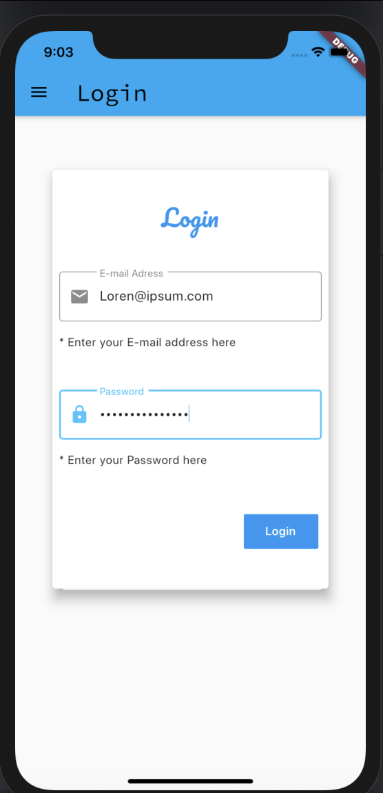

<h1 align="center">
    
</h1>

Mobile App feita em Flutter

📌 Login
------------------
O projeto foi feito com flutter e dart como layout e desenho de uma pagina de login

🔧 Tecnologias utilizadas:
------------------

- FLUTTER
- DART 

💬 Fale comigo
------------------
[*Entre em contato comigo*](https://www.linkedin.com/in/ivo-baptista-3712144/)

